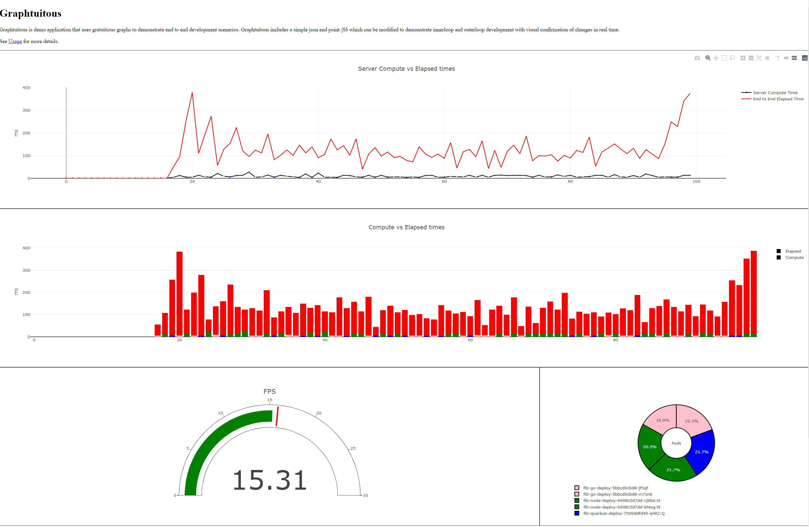
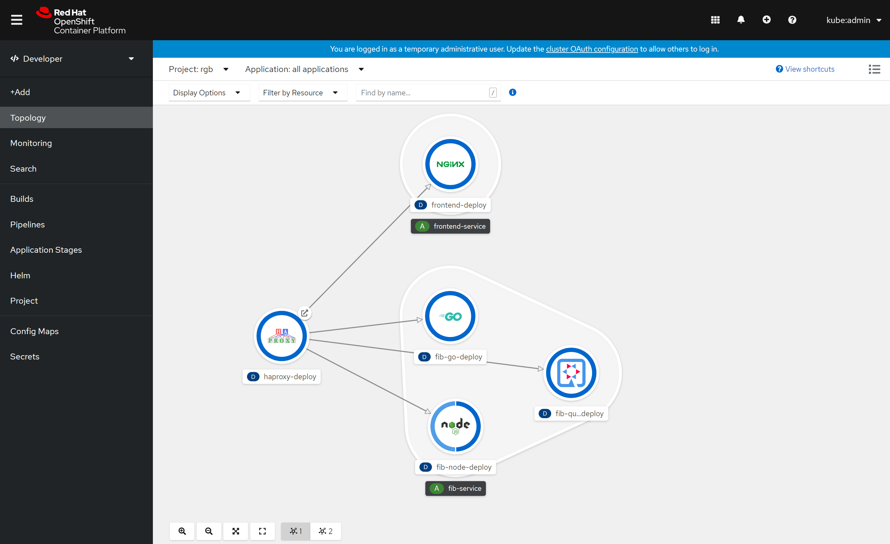

# Graphtuitous

Graphtuitous is demo application that uses gratuitious graphs to demonstrate a simple service to demonstrate e2e development, innerloop and outerloop. The service can be scaled, compute altered to demonstrate performance issues, and graph colours will allow visual confirmation of changes.



The app provides a frontend which has a GUI to graph response times to reading a service. The front end is the entrypoint to the service. The service has  one endpoint /fib and is used to demonstrate a simple application on kubernetes. The service has implementatins in node.js, quarkus and golang and has three deployments which are combined into a services via label selector. The frontend is an nginx server which is used to provide access to html resources. An HAProxy instance load balances between the services but is also used to provide local development via a dockerized runtime.

## Local Dev 

This application supports local dev (innerloop) a shell script `hack/dev.sh` (`hack/dev.cmd` on windows) will launch each services at a port and uses HAProxy to load balance across them transparently to the application. No code changes in the services is required in local dev mode.

Hot code replace is supported the node and quarkus examples. The Golang service requires restart. 

Note, on macos and linux, there is a handy shell script `sh verify-dependencies` which validates the local tools needed to be installed for local dev.


## Openshift Deploy

This application can be deploy via local deployment manifests on OpenShift. See `hack/deploy.sh` for the resources on kubernetes clusters. A route is included for openshift.
Once deployed the application can be found in the topology viewer.

If you are using argocd, you point to the `deploy` directory recursive and directly deploy this repository to your openshift cluster. 




## Internals 

The service is at endpoint `/fib` and returns a JSON result. The colour is provided to enable visual cues in this demo. 
You can modify the loop times for performance differences and watch load balancing and latency changes in realtime.

It will return a JSON object. 
```
{ 
        "hostname":"johnpc"
        "version": 1.1, 
        "colour": "blue",
        "count": 1,
        "stack": "runtime used in demo",  
        "loop": 1,
        "compute": "fib(n)",
        "time": 1
      }

``` 
 
`hostname`  Hostname of the pod that executed the service on kubernetes.This can be used to demonstrate replicas, failures
        and scaling.
	
`version` Version of the app that executed the service on kubernetes.  
  
 `colour`    Recommended graphing colour for demo purposes. Used to show live edit, and outerloop changes.
  
 `count`   Returns the number of times this server instance has returned a response.
        When a pod dies and is restarted, the counts restart at zero.
	
`stack`   Name of the runtime used to implement the service. Quarkus, node.js, java. 
        Can be used to demonstrate replacing a service in one language with another one using gitops or adding deployments.
	      
`loop` Loop count on how many times function is run. Currently hardcoded, to be changed to pass as argument.
   
   `compute` Server side function name and parameter as a string. 
  
   `time` Execution time on the server for the specific demo function and loop count.
   
  
