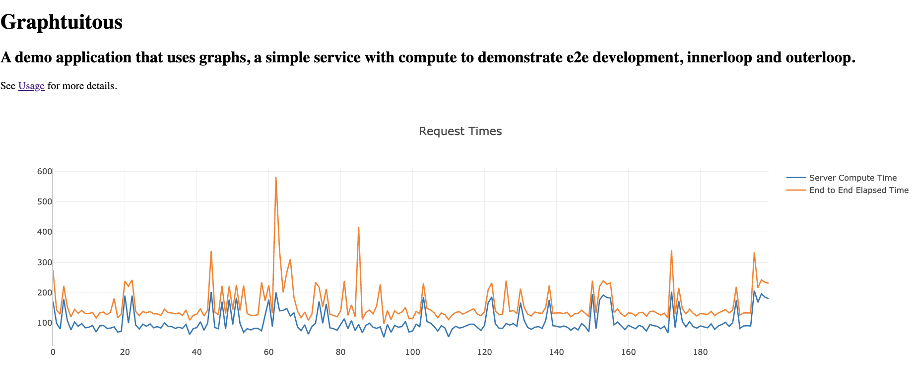

# Graphtuitous


Graphtuitous is demo application that uses graphs, a simple service with compute to demonstrate e2e development, innerloop and outerloop.
  
This app was ported from https://github.com/jduimovich/rgb into Quarkus.



This app has one endpoint /test and is used to demonstrate simple applications on kubernetes. 

It will return a JSON object. 
```
{ 
        "hostname":"johnpc"
        "version": 1.1, 
        "colour": "blue",
        "count": 1,
        "stack": "runtime used in demo",  
        "loop": 1,
        "compute": "fib(n)",
        "time": 1
      }

``` 
 
`hostname`  Hostname of the pod that executed the service on kubernetes.This can be used to demonstrate replicas, failures
        and scaling.
	
`version` Version of the app that executed the service on kubernetes.  
  
 `colour`    Recommended graphing colour for demo purposes. Used to show live edit, and outerloop changes.
  
 `count`   Returns the number of times this server instance has returned a response.
        When a pod dies and is restarted, the counts restart at zero.
	
`stack`   Name of the runtime used to implement the service. Quarkus, node.js, java. 
        Can be used to demonstrate replacing a service in one language with another one using gitops or adding deployments.
	      
`loop` Loop count on how many times function is run. Currently hardcoded, to be changed to pass as argument.
   
   `compute` Server side function name and parameter as a string. 
  
   `time` Execution time on the server for the specific demo function and loop count.
